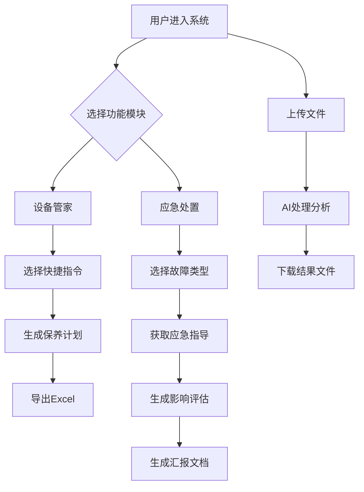

# 美智同学 - 产品需求文档

## 1. 产品概述
美智同学是一个静态演示页面，通过聊天式交互模拟AI对医院后勤管理的智能辅助能力。
- 主要解决医院设备台账管理复杂、应急处置响应慢的问题，为医院一线人员和后勤管理人员提供智能化支持。
- 目标是向领导展示AI技术在医院后勤管理中的应用价值和发展潜力。

## 2. 核心功能

### 2.1 用户角色
| 角色 | 使用场景 | 核心权限 |
|------|----------|----------|
| 医院一线人员 | 设备故障报修、应急情况处理 | 可查询设备信息、获取应急指导、生成汇报 |
| 后勤管理人员 | 设备保养计划、应急预案管理 | 可生成保养计划、查看影响评估、导出报表 |

### 2.2 功能模块
本系统包含以下核心页面：
1. **主聊天页面**：AI对话交互、消息展示、输入框
2. **设备管家模块**：设备台账管理、保养计划生成
3. **应急处置模块**：故障快速响应、影响评估、汇报生成

### 2.3 页面详情
| 页面名称 | 模块名称 | 功能描述 |
|----------|----------|----------|
| 主聊天页面 | 对话窗口 | 显示用户与AI的对话记录，支持文本和卡片消息 |
| 主聊天页面 | 输入框 | 用户输入问题，支持文本输入和快捷指令触发 |
| 主聊天页面 | 快捷指令面板 | 提供常用场景一键触发：设备保养、故障处理、应急响应等 |
| 主聊天页面 | 文件上传区 | 模拟多模态能力，上传Excel文件并生成对应的处理结果 |
| 设备管家模块 | 保养计划生成 | 根据设备信息生成个性化保养计划，支持导出Excel |
| 设备管家模块 | 设备台账展示 | 展示设备基本信息、保养记录、维修历史 |
| 应急处置模块 | 故障快速响应 | 提供标准应急流程、联系人信息、临时解决方案 |
| 应急处置模块 | 影响评估 | 评估故障影响范围、风险等级、优先级建议 |
| 应急处置模块 | 汇报生成 | 将处理过程整理成标准汇报格式，支持复制和导出 |

## 3. 核心流程
**主要用户操作流程：**

**设备管理流程：**
用户进入系统 → 选择"设备管家" → 点击"生成保养计划"快捷指令 → AI分析设备状态 → 生成个性化保养计划 → 导出Excel文件

**应急处置流程：**
用户遇到故障 → 选择"应急处置" → 点击对应故障类型 → AI提供应急指导 → 生成影响评估 → 联系相关人员 → 生成汇报文档

**文件处理流程：**
用户上传Excel文件 → 系统模拟解析 → AI生成处理建议 → 输出新的Excel文件 → 用户下载结果

## 4. 用户界面设计

### 4.1 设计风格
- **主色调**：医疗蓝 #2A85FF，传达专业可信的感觉
- **辅助色**：强调紫 #4F46E5，用于重要按钮和提示
- **按钮风格**：圆角矩形，轻微阴影，悬停有渐变效果
- **字体**：系统无衬线字体，正文14-16px，标题18-24px
- **布局风格**：卡片式设计，左右对话气泡，顶部导航栏
- **图标风格**：线性图标，简洁现代，与医疗主题相符

### 4.2 页面设计概览
| 页面名称 | 模块名称 | UI元素 |
|----------|----------|--------|
| 主聊天页面 | 顶部导航 | 品牌Logo、功能切换标签、主题切换按钮 |
| 主聊天页面 | 对话区域 | 左侧AI消息气泡（浅灰背景）、右侧用户消息气泡（蓝色背景）、时间戳 |
| 主聊天页面 | 输入区域 | 文本输入框、发送按钮、文件上传按钮 |
| 主聊天页面 | 侧边栏 | 快捷指令按钮组、文件上传区、汇报生成按钮 |
| 设备管家模块 | 功能卡片 | 流程图展示、示例表格、操作按钮 |
| 应急处置模块 | 响应面板 | 四象限布局、图标+文字说明、快速操作入口 |

### 4.3 响应式设计
- **桌面优先**：主要针对1920×1080分辨率优化，适配1366×768
- **移动适配**：支持平板和手机浏览，侧边栏可折叠
- **触控优化**：按钮尺寸适合触控操作，间距合理