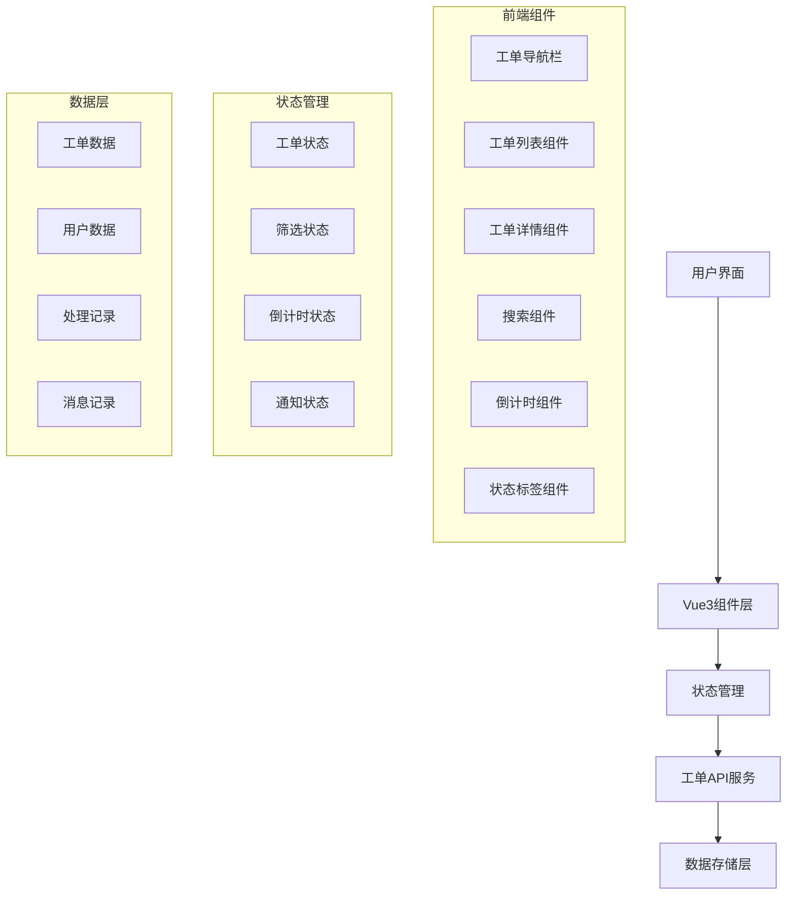
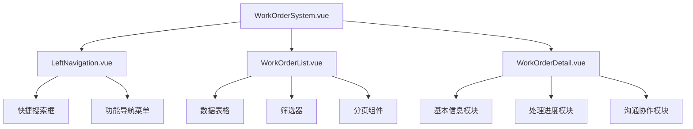

# 智能工单管理系统技术架构文档

## 1. 系统架构设计

### 1.1 整体架构

采用前后端分离架构，基于现有聊天系统集成工单管理功能：



### 1.2 组件架构



## 2. 技术栈描述

### 2.1 前端技术

* **框架**: Vue 3 + Composition API

* **UI组件**: Tailwind CSS + 自定义组件

* **状态管理**: Vue 3 reactive + provide/inject

* **图标**: SVG图标库

* **时间处理**: dayjs

* **倒计时**: 自定义倒计时组件

### 2.2 数据存储

* **本地存储**: localStorage + IndexedDB

* **数据格式**: JSON结构化存储

* **缓存策略**: 内存缓存 + 本地持久化

### 2.3 集成方案

* **与聊天系统集成**: 通过事件总线传递工单生成事件

* **自动派单**: 基于规则引擎自动分配处理组

* **状态同步**: 实时更新工单状态和处理进度

## 3. 路由定义

| 路由                      | 用途        |
| ----------------------- | --------- |
| /work-orders            | 工单管理系统主界面 |
| /work-orders/list       | 工单列表视图    |
| /work-orders/detail/:id | 工单详情视图    |
| /work-orders/analytics  | 统计分析视图    |

## 4. 核心组件设计

### 4.1 工单数据结构

```typescript
interface WorkOrder {
  id: string;                    // 工单编号 (WD-20251107-001)
  customerName: string;          // 客户姓名
  customerPhone: string;         // 客户联系方式
  problemType: string;           // 问题类型
  processingGroup: string;       // 处理组
  description: string;           // 问题描述
  status: 'pending' | 'processing' | 'completed' | 'overtime'; // 状态
  priority: 'low' | 'medium' | 'high' | 'urgent'; // 优先级
  createdAt: Date;              // 创建时间
  deadline: Date;                 // 截止时间
  completedAt?: Date;            // 完成时间
  handler?: string;              // 处理人
  progress: number;              // 进度百分比
  attachments: Attachment[];     // 附件列表
  comments: Comment[];           // 处理记录
}

interface ProcessingRecord {
  id: string;
  workOrderId: string;
  action: string;                // 操作类型
  description: string;           // 操作描述
  handler: string;               // 操作人
  timestamp: Date;               // 操作时间
  attachments?: string[];         // 附件路径
}
```

### 4.2 状态管理

```typescript
interface WorkOrderState {
  workOrders: WorkOrder[];        // 工单列表
  selectedWorkOrder: WorkOrder | null; // 选中工单
  filters: {
    status: string[];             // 状态筛选
    processingGroup: string[];    // 处理组筛选
    problemType: string[];        // 问题类型筛选
    searchText: string;           // 搜索文本
  };
  sortBy: string;                 // 排序字段
  sortOrder: 'asc' | 'desc';    // 排序顺序
  currentPage: number;            // 当前页码
  pageSize: number;               // 每页条数
}
```

## 5. 倒计时系统

### 5.1 倒计时组件

* **实时更新**: 每秒更新一次

* **颜色预警**:

  * 正常: 绿色 (#10B981)

  * 30分钟内: 橙色 (#F59E0B)

  * 超时: 红色 (#EF4444)

* **显示格式**: HH:MM:SS

### 5.2 超时处理

* **桌面通知**: 使用 Notification API

* **声音提醒**: 使用 Audio API

* **闪烁效果**: CSS动画实现

* **自动刷新**: 超时工单自动置顶

## 6. 交互设计

### 6.1 搜索功能

* **多字段搜索**: 工单编号、客户姓名、处理组

* **实时搜索**: 输入时实时筛选

* **搜索历史**: 保存最近搜索记录

### 6.2 筛选功能

* **状态筛选**: 多选状态标签

* **时间筛选**: 创建时间范围

* **处理组筛选**: 多选处理组

* **问题类型筛选**: 分类筛选

### 6.3 排序功能

* **多字段排序**: 创建时间、截止时间、优先级

* **升降序切换**: 点击表头切换排序

* **排序指示器**: 显示当前排序状态

## 7. 通知系统

### 7.1 超时通知

```typescript
interface TimeoutNotification {
  workOrderId: string;
  title: string;
  message: string;
  timeRemaining: number;  // 剩余时间(秒)
  priority: 'warning' | 'urgent';
}
```

### 7.2 状态变更通知

* **工单状态变更**: 待处理→处理中→已完成

* **处理人变更**: 重新分配处理组

* **进度更新**: 处理进度变化

## 8. 数据持久化

### 8.1 存储结构

```
localStorage:
├── workOrders: WorkOrder[]          // 工单数据
├── processingRecords: Record[]     // 处理记录
├── workOrderSettings: Settings   // 系统设置
└── searchHistory: string[]         // 搜索历史
```

### 8.2 数据同步

* **实时同步**: 状态变化立即保存

* **批量操作**: 支持批量状态更新

* **数据备份**: 定期导出数据

## 9. 性能优化

### 9.1 虚拟滚动

* **大数据列表**: 支持万级数据流畅渲染

* **分页加载**: 按需加载数据

* **缓存机制**: 减少重复计算

### 9.2 响应式设计

* **自适应布局**: 适配不同屏幕尺寸

* **移动端优化**: 触摸友好的交互

* **加载优化**: 懒加载和预加载结合

## 10. 安全与权限

### 10.1 数据安全

* **数据加密**: 敏感信息加密存储

* **访问控制**: 基于角色的权限管理

* **操作日志**: 记录所有操作行为

### 10.2 权限设计

* **管理员**: 全权限管理

* **处理组**: 处理相关工单

* **查看者**: 只读权限

## 11. 集成方案

### 11.1 与聊天系统集成

```typescript
// 聊天系统生成工单事件
interface GenerateWorkOrderEvent {
  type: 'generate_work_order';
  data: {
    customerName: string;
    customerPhone: string;
    problemType: string;
    description: string;
    processingGroup: string;
    priority: string;
  };
}
```

### 11.2 自动派单规则

* **基于问题类型**: 不同类型分配到对应处理组

* **基于优先级**: 高优先级优先处理

* **基于处理组负载**: 均衡分配工作量

## 12. 扩展功能

### 12.1 统计分析

* **工单统计**: 按状态、类型、处理组统计

* **效率分析**: 平均处理时间、超时率

* **趋势分析**: 问题类型趋势、处理效率趋势

### 12.2 报表导出

* **Excel导出**: 支持自定义字段导出

* **PDF报告**: 生成处理报告

* **图表展示**: 可视化数据展示

