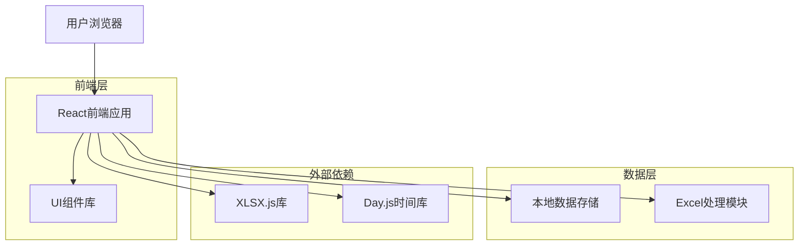
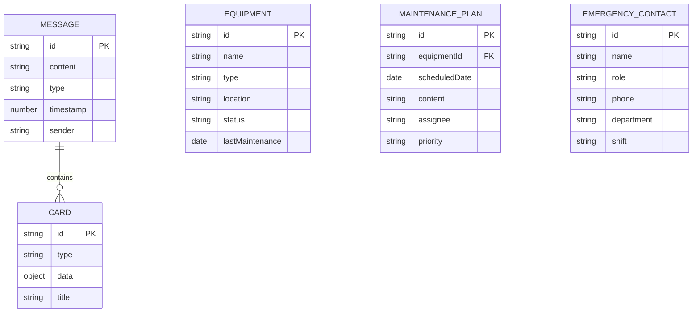

# 美智同学 - 技术架构文档

## 1. 架构设计



## 2. Technology Description

* Frontend: Vue\@3 + Vite + JavaScript + TailwindCSS\@3

* File Processing: XLSX.js (Excel文件处理)

* Time Handling: Day.js (时间格式化)

* Backend: None (纯静态前端)

## 3. 路由定义

| 路由          | 用途              |
| ----------- | --------------- |
| /           | 主页面，包含聊天界面和功能模块 |
| /#equipment | 设备管家模块视图        |
| /#emergency | 应急处置模块视图        |

注：使用Hash路由实现单页应用的视图切换，无需服务器配置。

## 4. API定义

由于是纯前端静态应用，所有数据交互都通过本地JavaScript函数实现：

### 4.1 核心数据接口

**聊天消息处理**

```javascript
// 发送消息
function sendMessage(content, type = 'text')
// 参数：
// - content: string, 消息内容
// - type: 'text' | 'card' | 'file', 消息类型

// 返回：
// {
//   id: string,
//   content: string,
//   type: string,
//   timestamp: number,
//   sender: 'user' | 'ai'
// }
```

**快捷指令处理**

```javascript
// 触发快捷指令
function triggerQuickAction(actionId)
// 参数：
// - actionId: string, 指令ID ('maintenance', 'elevator_fault', 'oxygen_alert', etc.)

// 返回：
// {
//   question: string,
//   answer: string,
//   cards: Array<CardData>,
//   actions: Array<ActionButton>
// }
```

**文件处理**

```javascript
// 处理上传文件
function processUploadedFile(file)
// 参数：
// - file: File, 上传的Excel文件

// 返回：
// {
//   success: boolean,
//   message: string,
//   outputFile: Blob,
//   fileName: string
// }
```

**汇报生成**

```javascript
// 生成汇报文档
function generateReport(chatHistory)
// 参数：
// - chatHistory: Array<Message>, 聊天记录

// 返回：
// {
//   title: string,
//   summary: string,
//   impact: string,
//   actions: string,
//   risks: string,
//   requests: string
// }
```

## 5. 数据模型

### 5.1 数据模型定义



### 5.2 数据定义语言

**消息数据结构**

```javascript
// 消息表 (messages)
const messageSchema = {
  id: 'string', // 唯一标识
  content: 'string', // 消息内容
  type: 'text|card|file', // 消息类型
  timestamp: 'number', // 时间戳
  sender: 'user|ai', // 发送者
  cards: 'Array<Card>' // 关联卡片（可选）
};

// 设备信息表 (equipment)
const equipmentSchema = {
  id: 'string',
  name: 'string', // 设备名称
  type: 'string', // 设备类型
  location: 'string', // 位置
  status: 'normal|warning|error', // 状态
  lastMaintenance: 'Date', // 上次保养时间
  nextMaintenance: 'Date', // 下次保养时间
  assignee: 'string' // 负责人
};

// 应急联系人表 (emergency_contacts)
const contactSchema = {
  id: 'string',
  name: 'string', // 姓名
  role: 'string', // 职务
  phone: 'string', // 电话
  department: 'string', // 科室
  shift: 'day|night|24h' // 班次
};
```

**初始化数据**

```javascript
// 设备数据
const mockEquipment = [
  {
    id: 'eq001',
    name: 'XXX主机',
    type: '医疗设备',
    location: '手术室A',
    status: 'normal',
    lastMaintenance: '2024-01-10',
    nextMaintenance: '2024-02-10',
    assignee: '张三'
  },
  {
    id: 'eq002', 
    name: '电梯A3',
    type: '运输设备',
    location: '住院楼A区',
    status: 'warning',
    lastMaintenance: '2024-01-15',
    nextMaintenance: '2024-01-22',
    assignee: '李四'
  }
];

// 应急联系人数据
const mockContacts = [
  {
    id: 'contact001',
    name: '王五',
    role: '设备科主任',
    phone: '138****0001',
    department: '设备科',
    shift: 'day'
  },
  {
    id: 'contact002',
    name: '赵六', 
    role: '总务科值班',
    phone: '139****0002',
    department: '总务科',
    shift: 'night'
  }
];

// 快捷指令配置
const quickActions = [
  {
    id: 'maintenance_plan',
    title: '生成保养计划',
    category: 'equipment',
    description: '根据设备状态生成个性化保养计划'
  },
  {
    id: 'elevator_fault',
    title: '电梯故障处理',
    category: 'emergency', 
    description: '电梯故障应急响应流程'
  },
  {
    id: 'oxygen_alert',
    title: '氧气站压力异常',
    category: 'emergency',
    description: '氧气供应系统异常处理'
  }
];
```

## 6. Mock数据结构

### 6.1 快捷指令配置

```javascript
// 快捷指令数据结构
const quickCommands = [
  {
    id: 'emergency_guide',
    title: '急救指南及一站式服务电话',
    category: 'emergency',
    content: {
      sections: [
        {
          title: '心肺复苏（CPR）',
          steps: ['判断意识与呼叫', '胸外按压（C）', '开放气道（A）', '人工呼吸（B）'],
          details: '针对心跳呼吸骤停（如溺水、触电、心梗）...'
        },
        {
          title: '创伤止血',
          types: ['毛细血管/小静脉出血', '静脉/动脉出血'],
          details: '针对外伤出血（如割伤、擦伤、撞击出血）...'
        },
        {
          title: '烫伤处理',
          method: '冲、脱、泡、盖、送',
          details: '针对热水、热油、高温物体烫伤...'
        },
        {
          title: '异物卡喉（海姆立克急救法）',
          targets: ['成人/1岁以上儿童', '婴儿（1岁以下）', '自救'],
          details: '针对成人/儿童食物/异物卡喉...'
        }
      ]
    }
  },
  {
    id: 'equipment_troubleshooting',
    title: '设备常见故障及处理',
    category: 'equipment',
    content: {
      faults: [
        {
          phenomenon: '空开跳闸',
          causes: ['短路', '过流', '漏电', '散热不畅', '型号不符', '接地故障'],
          detection: ['测绝缘', '测电流', '测温度', '检查型号', '测接地电阻'],
          tools: ['万用表', '钳形电流表', '摇表']
        },
        {
          phenomenon: '程序不执行或乱动作',
          causes: ['PLC故障或处于停止模式', 'PLC输入条件设定', '其他干扰'],
          detection: ['查看PLC状态指示灯', '检查PLC运行指示灯', '观察并记录故障发生情况'],
          tools: ['目视观察']
        },
        {
          phenomenon: '人机界面有显示但按键无反应',
          causes: ['通讯不畅'],
          detection: ['看通讯指示灯是否有规律的闪烁', '检查通讯线是否牢固', '接头是否生锈氧化等'],
          tools: ['目视观察']
        },
        {
          phenomenon: '人机界面无显示',
          causes: ['24v电源电压低或虚接', '电源线接反导致保险管烧坏', '电压波动大或环境问题导致CPU损坏', '人机界面死机'],
          detection: ['看电源灯是否亮', '观察开关电源指示灯是否正常', '测量开关电源输出', '看CPU指示灯是否闪亮', '检查保险管'],
          tools: ['万用表']
        }
      ]
    }
  },
  {
    id: 'patient_compensation',
    title: '突发情况时，患者要求赔偿怎么办？',
    category: 'management',
    content: {
      principle: '先安抚患者情绪、稳控场面，不主动归责、不承诺赔偿，明确告知"需负责人调查后处理"，避免因不当表述引发责任争议。'
    }
  }
]
```

### 6.2 联系人数据结构

```javascript
// 紧急联系人数据
const emergencyContacts = {
  managers: [
    { role: '项目经理', name: 'XXX', phone: '123XXXX4215' },
    { role: '工程经理', name: 'XXX', phone: '134XXXX0214' },
    { role: '工程主管', name: 'XXX', phone: '142XXXX4211' },
    { role: '保洁经理', name: 'XXX', phone: '123XXXX4234' },
    { role: '保洁主管', name: 'XXX', phone: '164XXXX4213' }
  ],
  onDutyStaff: [
    { role: '工程技工', name: 'XXX', phone: '123XXXX4215', equipment: '接水盘，围挡' },
    { role: '工程技工', name: 'XXX', phone: '134XXXX0214', equipment: '沙袋' },
    { role: '保洁员', name: 'XXX', phone: '142XXXX4211' },
    { role: '保洁员', name: 'XXX', phone: '123XXXX4234' },
    { role: '值班秩序员', name: 'XXX', phone: '135XXXX3415', equipment: '应急降温风扇' }
  ]
}
```

### 6.3 设备保养计划数据结构

```javascript
// 设备保养计划模板
const maintenancePlan = {
  template: {
    headers: ['设备名称', '保养时间', '保养内容', '责任人', '风险等级', '备注'],
    sampleData: [
      {
        equipmentName: 'XXX主机',
        maintenanceTime: '每月10日',
        maintenanceContent: '清洁XXX配件; 检查XXX压力; 添加XXX剂',
        responsible: '张三',
        riskLevel: '低',
        remarks: '常规保养'
      },
      {
        equipmentName: '电梯A3',
        maintenanceTime: '每周巡检',
        maintenanceContent: '制动系统检查; 通讯测试',
        responsible: '李四',
        riskLevel: '中',
        remarks: '夜间执行'
      }
    ]
  }
}
```

### 6.4 事件汇报数据结构

```javascript
// 事件汇报模板
const incidentReport = {
  template: {
    headers: ['事件标题', '时间', '科室/位置', '影响范围', '临时措施', '负责人', '下一步'],
    sampleData: [
      {
        title: '综合楼七楼东侧病房区爆水管',
        time: '2024-01-15 14:30',
        location: '综合楼七楼',
        impact: 'A2-A5病区供冷可能受影响',
        temporaryMeasures: '已通知工程技工携带接水盘、围挡；通知保洁员现场处理',
        responsible: '工程部值班人员',
        nextSteps: '排查漏水原因，修复管道，恢复正常供冷'
      }
    ]
  }
}
```

